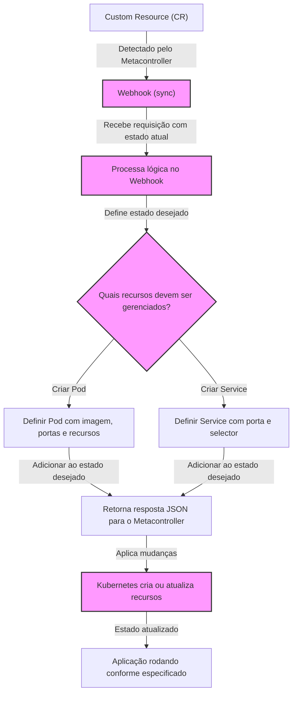

<!-- BEGIN_DOCS -->
<div align="center">

<a name="readme-top"></a>


## Kubernetes Metacontroller

Hello Human 👽! Bem-vindo ao meu repositório 👋

Pronto para derrubar um cluster Kubernetes? 🤡 hahaha

[](https://www.conventionalcommits.org/en/v1.0.0/)
[](https://semantic-release.gitbook.io/semantic-release/usage/configuration)
[](https://jetpack.io/devbox/docs/contributor-quickstart/)

</div>

# Sumário

<details>
  <summary><strong>Expandir</strong></summary>

- [Visão Geral](#visão-geral)
  - [Objetivo](#objetivo)
  - [Contexto e Motivação](#contexto-e-motivação)
- [Tecnologias](#tecnologias)
- [Entendendo](#entendendo)
- [Contributing](#contributing)
- [Versioning](#versioning)
- [Troubleshooting](#troubleshooting)
- [Show your support](#show-your-support)

<p align="right">(<a href="#readme-top">back to top</a>)</p>

</details>

# Visão Geral

## Objetivo

Deixando as brincadeiras de lado, nesse repositório apresento a vocês um exemplo prático de como eu criei um controlador personalizado no Kubernetes utilizando a ferramenta [Metacontroller](https://github.com/metacontroller/metacontroller).

Minha proposta é colocar a mão na massa e documentar todo esse processo, desde o conceitual até a implementação prática, para que você possa entender como funciona e como pode ser útil para o seu dia a dia.

## Contexto e Motivação

O Kubernetes é uma plataforma incrível por inúmeras razões. Ele não só gerencia e organiza cargas de trabalho de forma excepcional (desde que você não faça merda kkkk), mas sua verdadeira força reside na flexibilidade. Com essa característica intrínseca, o Kubernetes pode ser ampliado e personalizado de forma praticamente infinita, permitindo que você o adapte exatamente de acordo com as suas necessidades. É essa capacidade de moldar o Kubernetes para atender a requisitos únicos que o torna uma ferramenta indispensável para qualquer empresa e que me motivo a explorar e compartilhar esse conhecimento.

<p align="right">(<a href="#readme-top">back to top</a>)</p>

# Tecnologias

Para a implementação desse projeto, foram utilizadas as seguintes tecnologias:

- [Docker](https://docs.docker.com/get-docker/)
- [Kind](https://kind.sigs.k8s.io/)
- [Kubernetes](https://kubernetes.io/)
- [Metacontroller](https://metacontroller.github.io/metacontroller/intro.html)
- [Python](https://www.python.org/)

Existem outras ferramentas envolvidas, mas essas são as principais que você precisa conhecer para entender o projeto.

<p align="right">(<a href="#readme-top">back to top</a>)</p>

# Entendendo

## O que são Controladores no Kubernetes?

Controladores são loops que observam o estado do cluster através da API do Kubernetes e realizam ações para alinhar o estado atual ao estado desejado. Eles são essenciais para a automação e extensibilidade do Kubernetes. Exemplos de controladores nativos incluem:

- **Deployments**: Garante que um conjunto de pods esteja sempre em execução.
- **StatefulSets**: Gerencia aplicações stateful com identidade persistente.
- **Horizontal Pod Autoscaler (HPA)**: Ajusta automaticamente o número de réplicas de pods com base na carga de CPU ou outras métricas.

## O que são Custom Resource Definitions (CRDs)?

Os **Custom Resource Definitions (CRDs)** permitem que os usuários definam novos tipos de recursos no Kubernetes, expandindo sua API sem modificar o código-fonte do Kubernetes. Eles são a base para a criação de controladores personalizados, pois possibilitam a adição de novos objetos específicos ao cluster.

**Como ele funciona?**

- Você cria um CRD para definir um novo tipo de recurso (exemplo: `MyCustomResource`).
- O Kubernetes passa a reconhecer esse recurso e permite que ele seja gerenciado via `kubectl`, API e operadores.
- Um controlador personalizado pode ser implementado para monitorar e agir sobre esse novo recurso.

```yaml
apiVersion: apiextensions.k8s.io/v1
kind: CustomResourceDefinition
metadata:
  name: widgets.example.com
spec:
  group: example.com
  versions:
    - name: v1
      served: true
      storage: true
  scope: Namespaced
  names:
    plural: widgets
    singular: widget
    kind: Widget
```

## Metacontroller

O **Metacontroller** é um componente que simplifica a implementação de **controladores personalizados** sem exigir o desenvolvimento completo de um controlador em `Go` usando o `client-go`. Em vez disso, ele permite que os desenvolvedores criem controladores como **webhooks**, podendo ser escritos em qualquer linguagem que suporte HTTP, como `Python`, `Node.js` ou `Bash`.

**Como ele funciona?**

- O Metacontroller monitora recursos no Kubernetes.
- Quando há mudanças, ele aciona um webhook definido pelo usuário.
- O webhook responde informando como o estado desejado deve ser ajustado.
- O Metacontroller aplica essas mudanças automaticamente no cluster.

**Entre seus principais benefícios, podemos destacar**:

- Reduz a complexidade do desenvolvimento de controladores personalizados
- Permite o uso de qualquer linguagem para a lógica de controle
- Funciona como um intermediário entre o Kubernetes e os webhooks

## Tipos de Metacontrollers

O Metacontroller oferece diferentes tipos de controladores que podem ser utilizados dependendo do caso de uso:

**CompositeController**

Permite definir objetos "pai" que gerenciam um conjunto de objetos "filho". Útil para criar abstrações que agrupam múltiplos recursos. Exemplo: Criar um **Application CRD** que gera automaticamente Deployments, Services e ConfigMaps associados.

**DecoratorController**

Modifica objetos existentes ao adicionar novos recursos sem alterar sua definição original. Adicionar sidecars automaticamente a todos os pods que correspondem a um critério.

## Metacontroller vs. Operadores Tradicionais

| Característica                  | Metacontroller       | Operadores com client-go              |
| ------------------------------- | -------------------- | ------------------------------------- |
| **Facilidade de implementação** | Alta (webhooks)      | Média (Go, client-go)                 |
| **Linguagem suportada**         | Qualquer linguagem   | Principalmente Go                     |
| **Flexibilidade**               | Alta                 | Média                                 |
| **Integração com Kubernetes**   | Boa                  | Boa                                   |
| **Uso recomendado**             | Casos simples/médios | Casos complexos e performance crítica |

# Arquitetura

A partir de agora, vou de fato ir para a implementação prática do controlador personalizado usando o Metacontroller. Para isso, vamos criar um exemplo simples de um controlador que gerencia um recurso personalizado chamado `PodService`. Esse recurso é uma abstraction que combina um Pod e um Service, permitindo que você defina ambos em um único objeto.

A arquitetura do projeto é:



<p align="right">(<a href="#readme-top">back to top</a>)</p>

# Implementação

## Pré-requisitos

Antes de começar, você precisa ter instalado em sua máquina:

- [Docker](https://docs.docker.com/get-docker/)
- [Kind](https://kind.sigs.k8s.io/docs/user/quick-start/)
- [Kubectl](https://kubernetes.io/docs/tasks/tools/install-kubectl/)
- [Python](https://www.python.org/downloads/)
- [Pip](https://pip.pypa.io/en/stable/installation/)

## Passo a Passo

1. **Crie um Cluster Kubernetes com Kind**

```bash
task kind:create
```

2. **Instale o Metacontroller**

```bash
task addons:metacontroller
```

3. **Crie um Custom Resource Definition (CRD)**

```bash
kubectl apply -f manifests/crd.yaml
```

4. **Crie um Webhook em Python**

5. **Crie um CompositeController**

```bash
kubectl apply -f manifests/controller.yaml
```

6. **Teste o Controlador Personalizado**

```bash

```

7. **Limpeza**

```bash

```

# Conclusão

Use o Metacontroller, quando:

- Você deseja criar um controlador personalizado sem escrever um controlador em Go.
- Você quer escrever a lógica do controlador em Python, Node.js ou qualquer linguagem que suporte webhooks.
- Você precisa estender recursos já existentes sem modificar sua estrutura diretamente.

Não use o Metacontroller, quando:

- Você precisa de controladores com lógica muito complexa e de alta performance (Go pode ser mais eficiente).
- Você tem necessidade de interação intensiva com a API do Kubernetes.

No geral, o Metacontroller é uma ferramenta poderosa para simplificar o desenvolvimento de controladores personalizados no Kubernetes, permitindo que você se concentre na lógica de controle em vez de se preocupar com a complexidade da API do Kubernetes.

<p align="right">(<a href="#readme-top">back to top</a>)</p>

# Referências

Links relevantes para esse projeto:

- [Metacontroller Docs](https://metacontroller.github.io/metacontroller/intro.html)
- [What is a Kubernetes Controller?](https://book-v1.book.kubebuilder.io/basics/what_is_a_controller.html)

<p align="right">(<a href="#readme-top">back to top</a>)</p>

# Contributing

Gostaria de contribuir? Isso é ótimo! Temos um guia de contribuição para te ajudar. Clique [aqui](CONTRIBUTING.md) para lê-lo.

<p align="right">(<a href="#readme-top">back to top</a>)</p>

# Versioning

Para verificar o histórico de mudanças do projeto, acesse o arquivo [**CHANGELOG.md**](CHANGELOG.md).

<p align="right">(<a href="#readme-top">back to top</a>)</p>

# Troubleshooting

Se você tiver algum problema, [abra uma issue nesse projeto](https://github.com/homelabsz/helm-charts/issues).

<p align="right">(<a href="#readme-top">back to top</a>)</p>

# Show your support

<div align="center">

Dê uma ⭐️ para esse projeto se ele te ajudou!


<br>
<br>

Feito com 💜 por [mim](https://github.com/lpsm-dev) :wave: inspirado no [readme-md-generator](https://github.com/kefranabg/readme-md-generator)

</div>

<p align="right">(<a href="#readme-top">back to top</a>)</p>
<!-- END_DOCS -->
